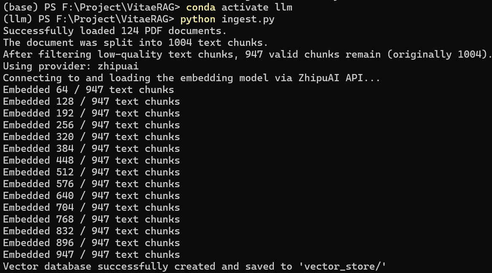
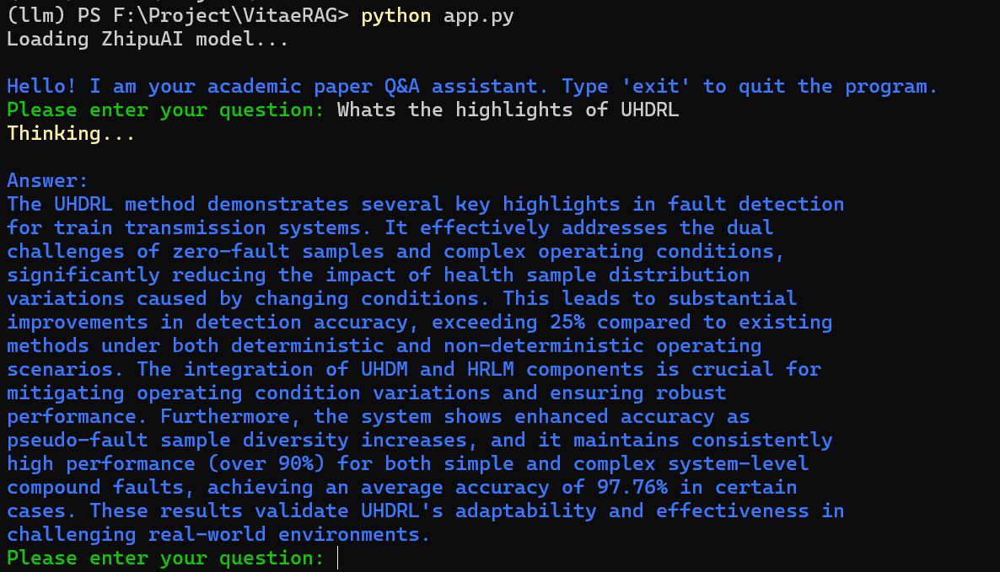

# VitaeRAG: Local Knowledge Base Q&A with RAG


This is a local knowledge base Q&A project based on **Retrieval-Augmented Generation (RAG)** technology.  
You can upload your own PDF papers, and the project will process them into a vector database.  
Then, through a command-line interface, you can query the contents of these papers using a Large Language Model (LLM).

## 📂 Project Structure

```tree
rag-llm-project/
├── data/
│   └── (Please put your PDF papers here)
├── vector_store/
│   └── (This folder will be automatically created by ingest.py to store vector indexes)
├── ingest.py          # 1. Script to process PDFs and create the vector database
├── app.py             # 2. Main application for Q&A with your papers
├── requirements.txt   # 3. Python dependencies required for the project
└── README.md          # 4. Project documentation
```

## 🚀 Usage Steps

### 1. Environment Setup
First, ensure you have **Python 3.8 or higher** installed.  
Then, clone or download this project, open a terminal in the project root directory, and (optionally) create a virtual environment before installing dependencies:

```bash
pip install -r requirements.txt
```

### 2. Configure the LLM API
This project is set up to call a large language model (such as DeepSeek) via API.

First, create a file named `.env` in the project root directory.

Then, open the `.env` file and add your API key and API endpoint in the following format.This repository currently supports **DeepSeek** and **ZhipuAI**.
 For example, using DeepSeek:

```
LLM_PROVIDER="deepseek"
DEEPSEEK_API_KEY="your_deepseek_api_key_here"
DEEPSEEK_API_BASE="https://api.deepseek.com/v1"
DEEPSEEK_EMBEDDING_MODEL="text-embedding-v2"
DEEPSEEK_CHAT_MODEL="deepseek-chat"
```


Replace `your_deepseek_api_key_here` with your actual key.  
The `app.py` script will automatically load this information from the file.


### 3. Add Your PDF Files
Place the PDF papers or documents you want to query inside the `data` folder in the project root.


### 4. Create the Vector Database
Run the `ingest.py` script in the terminal.  
This script will read all the PDFs in the `data` folder, process and split them, generate embeddings, and finally create a FAISS index file in the `vector_store` folder.

```bash
python ingest.py
```
This step only needs to be done once unless your document library changes.

### 5. Start Asking Questions!

Once the vector database has been created, you can run the main application app.py to start asking questions.
```
python app.py
```

After the program starts, you can type questions in the terminal, and the model will respond based on the content of your papers.
Type exit to quit the program.

✨ Enjoy your usage!

<div style="display: flex; justify-content: center; gap: 40px; flex-wrap: wrap; margin: 20px 0;">
  <div style="text-align: center; max-width: 220px;">
    
    <div style="font-size:14px; font-weight:600; color:#333;">run ingest.py</div>
  </div>
  <div style="text-align: center; max-width: 220px;">
    
    <div style="font-size:14px; font-weight:600; color:#333;">run app.py</div>
  </div>
</div>
